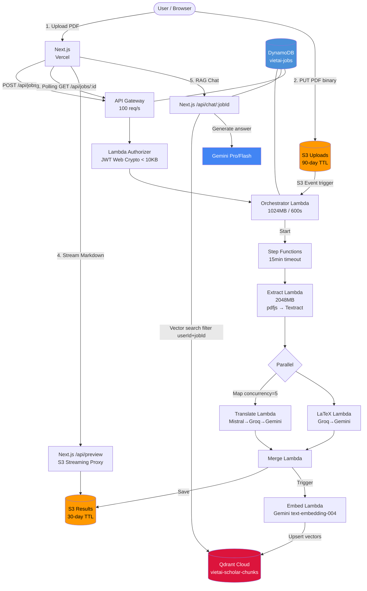

# Kiến trúc hệ thống — VietAI Scholar

## Sơ đồ tổng quan



---

## Lambda Functions

| Lambda | Entry | RAM | Timeout | Vai trò |
|--------|-------|-----|---------|---------|
| Orchestrator | `lambda/index.ts` | 1024 MB | 600s | Main handler, S3 trigger, API routing |
| Extract | `lambda/handlers/extract.ts` | 2048 MB | 120s | PDF → text (pdfjs + Textract fallback) |
| Translate | `lambda/handlers/translate.ts` | 512 MB | 60s | Chunk dịch EN→VI |
| LaTeX | `lambda/handlers/latex.ts` | 512 MB | 60s | Chuẩn hóa công thức toán |
| Merge | `lambda/handlers/merge.ts` | 512 MB | 60s | Gộp → Markdown song ngữ cuối |

---

## AI Fallback Chain

```
Dịch thuật:   Mistral 7B → Groq (Llama 3.3 70B) → Gemini 2.0 Flash
LaTeX/Diagram: Groq → Gemini 2.0 Flash
Embedding:    Gemini text-embedding-004 (768 dims)
RAG Chat:     Gemini Pro/Flash
```

Tất cả AI calls: `temperature: 0.3`, `max_tokens: 4096`

---

## DynamoDB Schema

```json
{
  "jobId": "string (PK)",
  "userId": "string (default: 'guest')",
  "status": "pending|extracting|processing|completed|failed",
  "fileName": "string",
  "s3Key": "string",
  "createdAt": "number (epoch)",
  "expiresAt": "number (epoch, 30 ngày)",
  "s3OutputKey": "string?",
  "hasFormula": "boolean?",
  "hasDiagram": "boolean?"
}
```

GSI: `userIdIndex` (userId + createdAt) — dùng cho Library listing.

---

## Qdrant Multi-tenancy

Collection duy nhất: `vietai-scholar-chunks`

Payload mỗi vector:
```json
{
  "userId": "...",
  "jobId": "...",
  "text_original": "...",
  "text_translated": "...",
  "chunkIndex": 12
}
```

Filter bắt buộc trên **mọi** query: `userId == X AND jobId == Y` → bảo mật phân quyền.

---

## Liên kết
- [docs/architecture-be.md](../../docs/architecture-be.md)
- [docs/architecture-fe.md](../../docs/architecture-fe.md)
- [docs/integration-architecture.md](../../docs/integration-architecture.md)
- [[ADR-003-Qdrant-RAG]]
