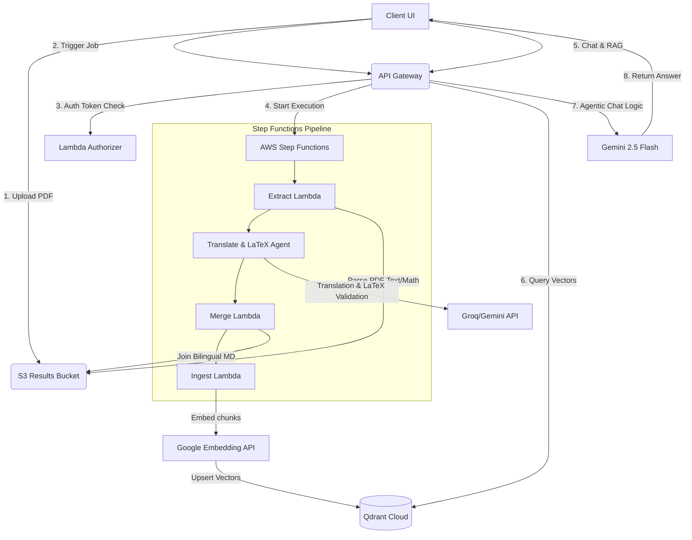

# Hướng Dẫn Kỹ Thuật & Phân Công Nhiệm Vụ Dự Án Luminary Scholar (Luminary)

> Tài liệu onboarding, phân chia công việc nội bộ và kế hoạch phát triển dài hạn dành cho đội ngũ phát triển.  
> Cập nhật mới nhất: 2026-07-07

---

## 1. Ý Tưởng & Chức Năng Cốt Lõi Của Ứng Dụng (Product Overview)

**Luminary Scholar** (tên nội bộ: *Luminary*) không phải là một công cụ dịch thuật PDF thông thường (như Google Translate hay các tool dịch file phổ thông). Đây là một **Không gian làm việc thông minh (Bilingual Workspace) tích hợp Trợ lý AI dành riêng cho người đọc, nghiên cứu tài liệu học thuật & bài báo khoa học tiếng Anh.**

### 1.1. Các vấn đề sản phẩm giải quyết:
*   **Rào cản ngôn ngữ chuyên ngành**: Đọc bài báo khoa học tiếng Anh tốn nhiều thời gian.
*   **Hỏng định dạng công thức toán**: Các công cụ dịch thông thường làm biến dạng mã LaTeX.
*   **Mất ngữ cảnh biểu đồ**: Hình vẽ và sơ đồ trong bài viết gốc bị bỏ qua khi dịch.
*   **Thiếu tương tác học tập**: Người đọc thụ động, không có cách tự đánh giá mức độ hiểu bài.

### 1.2. Các chức năng chính của Web App:
*   **Upload & Dịch thuật chuyên sâu**: Tải PDF lên S3, AI dịch song ngữ, giữ nguyên LaTeX và trích dẫn khoa học.
*   **Bilingual Reader**: Xem 2 cột song song gốc-dịch cuộn đồng bộ, chuyển tab thông minh trên Mobile.
*   **AI Tutor Chat (RAG)**: Chat trực tiếp hỏi đáp tài liệu kết nối Qdrant Vector DB, trích dẫn ngược nguồn `[Đoạn X]`.
*   **Thư viện cá nhân**: Quản lý tài liệu theo thời gian, hỗ trợ lưu trữ và xem lại kết quả tức thì.
*   **Bộ công cụ tự học (Active Learning)**: Tự sinh Trắc nghiệm (Quiz), Thẻ ghi nhớ (Flashcards), Sơ đồ tư duy (Mindmap Mermaid), Audio Podcast đối thoại (TTS).
*   **Khám phá chủ đề (Explore Mode)**: Sinh Topic Map dàn ý tri thức và tìm cào nạp bài nghiên cứu tự động.
*   **Thesis Defense Studio**: Phòng phản biện luận án ảo 3 cột, theo dõi hồ sơ năng lực học viên và vẽ đồ thị mạng lưới tri thức 2D.

---

## 2. Kiến Trúc Hệ Thống & Nguyên Lý Hoạt Động (Architecture Overview)

Dự án được triển khai dưới dạng **Monorepo**:
1.  **Frontend (`fe/`)**: Next.js 16 Web App, render giao diện client và điều phối Next-Auth.
2.  **Backend (`be/`)**: AWS CDK serverless backend, quản lý Lambda, DynamoDB, S3, Step Functions và Qdrant.

### Sơ đồ luồng xử lý dữ liệu chính:

### Cách thức hoạt động của các cấu phần cốt lõi:
*   **Pipeline Dịch thuật**: Kích hoạt bất đồng bộ qua Step Functions. Lambda `Extract` phân tích PDF, các Lambda agent dịch thuật song song (Map state) và chuẩn hóa LaTeX, `Merge` tổng hợp thành Markdown song ngữ.
*   **Vector hóa (RAG Ingestion)**: Lambda `Ingest` đọc file Markdown kết quả, phân tách thành các đoạn văn nhỏ và tạo vector embeddings 768 chiều (Gemini API) đẩy lên Qdrant Cloud.
*   **Thesis Defense Loop**: Vòng lặp logic phản hồi 2 pha: **Evaluator** (chấm điểm câu trả lời, tìm lỗ hổng kiến thức qua RAG Qdrant) và **Planner** (quyết định hỏi tiếp hay dừng). Lỗ hổng kiến thức được lưu trữ lâu dài trong hồ sơ năng lực DynamoDB.

---

## 3. Nhật Ký Trạng Thái Các Phân Hệ (Project Status)

Dự án đã hoàn tất toàn bộ các mốc tiến độ chính (Epics 1-5):

*   **Epic 1: Giao diện & Tải lên tài liệu (Hoàn thành)**: Kéo thả PDF, kiểm tra dung lượng file, upload qua S3 Presigned URL, Bilingual Reader cuộn đồng bộ, hiển thị LaTeX qua KaTeX.
*   **Epic 2: Xác thực & Quản lý Thư viện (Hoàn thành)**: Next-Auth v5, Custom Lambda Authorizer JWT, S3 API Proxy, trang Thư viện cá nhân `/library` kèm bộ lọc.
*   **Epic 3: AI Tutor & Trích xuất Vector (Hoàn thành)**: Workspace 3 cột, Agentic RAG chat với tài liệu qua Gemini 2.5 Flash & Qdrant Cloud, tích hợp Semantic Scholar hiển thị bài báo liên quan.
*   **Epic 4: Học tập đa chiều & Chia sẻ tri thức (Hoàn thành)**: AI Quiz Generator, AI Flashcard Generator, Sơ đồ tư duy Mermaid.js, Audio Podcast TTS (Google TTS + AWS Polly fallback), trang chơi Quiz công khai bảo mật `/share`.
*   **Epic 5: Khám phá học thuật & Phản biện Thesis Defense (Hoàn thành)**: Explore Mode Topic Map, Thesis Defense Simulator (Evaluator/Planner Reasoning Loop), Student Competency Profile (Decay Algorithm), 2D Force-Directed Knowledge Graph, Research Copilot task suggestions.

---

## 4. Kế Hoạch Phân Công Cho Epic Tiếp Theo (Epic 6: Future Backlog)

Dành cho giai đoạn phát triển tiếp theo (Epic 6), các nhóm lập trình viên sẽ tập trung vào mở rộng khả năng và tối ưu hóa hệ thống:

### 🛠️ Nhóm 1: Tối ưu hóa Hiệu năng & Bảo mật (DevOps & Backend)
*   **Task 1.1: Quản lý Quotas & AI Billing Alerts**: Cấu hình kiểm soát chi phí API của Groq, Gemini và Google TTS. Thiết lập CloudWatch Alarms cảnh báo nếu chi phí AWS vượt ngưỡng ngân sách.
*   **Task 1.2: Fine-Tuning mô hình dịch thuật chuyên ngành**: Nghiên cứu xây dựng tập dữ liệu song ngữ chuyên ngành (khoa học máy tính, y sinh, kinh tế) để fine-tune mô hình nhỏ (Llama 3 8B / Mistral 7B) nhằm giảm chi phí gọi API thương mại.
*   **Task 1.3: Shadow Ingestion & Caching**: Tích hợp Redis/ElastiCache lưu trữ các câu trả lời RAG thường gặp để giảm tải truy vấn vector DB và LLM.

### 🎨 Nhóm 2: Trải nghiệm người dùng & Học tập Cộng tác (Frontend)
*   **Task 2.1: Nhóm học tập cộng tác (Collaborative Study Groups)**: Cho phép nhiều học viên tham gia cùng một phiên phản biện luận án ảo hoặc cùng đóng góp vào một note nghiên cứu chung.
*   **Task 2.2: Đồng bộ hóa Obsidian App**: Phát triển Obsidian plugin chính thức cho phép tự động đồng bộ note nghiên cứu và Markdown song ngữ từ thư viện Luminary Scholar về máy tính cá nhân.
*   **Task 2.3: Offline Reader**: Hỗ trợ lưu trữ bản dịch song ngữ dưới dạng IndexedDB ở client để học viên có thể tiếp tục đọc nghiên cứu khi mất kết nối mạng.

---

## 5. Quy Chuẩn Vận Hành Đội Ngũ (Team Guidelines)

1.  **Bảo vệ Dữ liệu Nhạy cảm**: Tuyệt đối không commit file cấu hình chứa API key lên GitHub. Mọi API key phải được cập nhật qua AWS Secrets Manager.
2.  **Độ tin cậy của code**: Mọi pull request (PR) bắt buộc phải vượt qua toàn bộ các bài test Jest và Playwright.
3.  **Tính đồng bộ của hạ tầng**: Không chỉnh sửa tài nguyên thủ công trên AWS Console. Mọi thay đổi về S3, DynamoDB, Lambda, API Gateway phải được định nghĩa trong CDK stack (`be/lib/be-stack.ts`).
