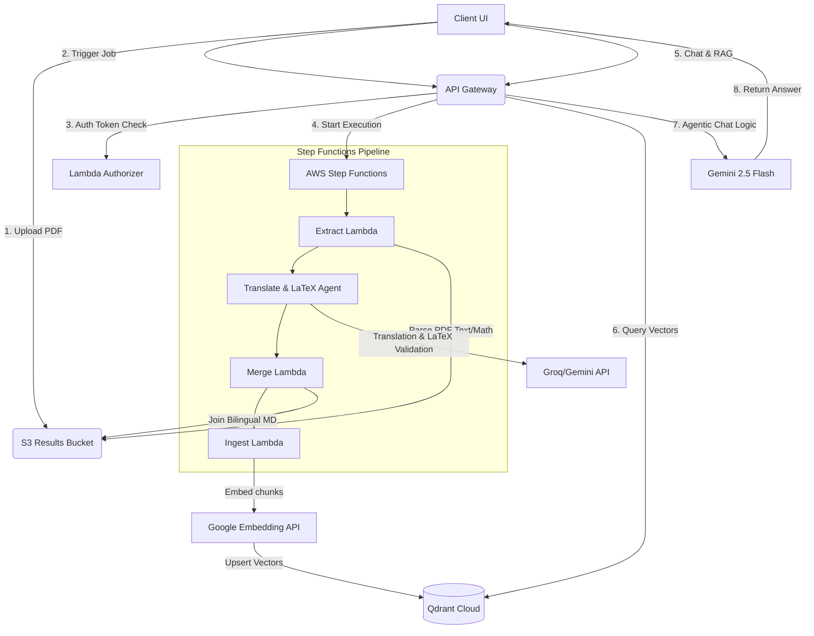

# Hướng Dẫn Kỹ Thuật & Phân Công Nhiệm Vụ Dự Án VietAI Scholar (Luminary)
*(Tài liệu onboarding và phân chia công việc nội bộ dành cho đội ngũ phát triển)*

Chào cả nhà, đây là tài liệu tổng hợp giúp các thành viên trong team nhanh chóng nắm bắt mục tiêu sản phẩm, các chức năng của ứng dụng dưới góc độ sản phẩm, kiến trúc kỹ thuật hiện tại của dự án **VietAI Scholar (Luminary)**, và định hướng phát triển tiếp theo.

---

## 📌 Ý Tưởng & Chức Năng Cốt Lõi Của Ứng Dụng (Product Overview)

Để cả team hiểu rõ chúng ta đang làm cái gì: **VietAI Scholar** (tên nội bộ: *Luminary*) không phải là một công cụ dịch thuật PDF thông thường (như Google Translate hay các tool dịch file phổ thông). Đây là một **Không gian làm việc thông minh (Bilingual Workspace) tích hợp Trợ lý AI dành riêng cho người đọc, nghiên cứu tài liệu học thuật & bài báo khoa học tiếng Anh.**

### 1. Vấn đề sản phẩm giải quyết (The Problem):
* **Rào cản ngôn ngữ trong nghiên cứu**: Đọc các bài báo khoa học (arXiv, IEEE, Nature...) bằng tiếng Anh rất tốn thời gian đối với sinh viên, nghiên cứu sinh Việt Nam do từ chuyên ngành phức tạp.
* **Hỏng định dạng công thức toán**: Các công cụ dịch thông thường khi gặp công thức toán (LaTeX) sẽ dịch sai hoặc làm biến dạng ký tự, khiến công thức không đọc được nữa.
* **Mất ngữ cảnh biểu đồ & sơ đồ**: Hình vẽ và sơ đồ trong bài viết gốc bị bỏ qua khi dịch.
* **Thiếu tính tương tác**: Người đọc chỉ đọc thụ động, không thể hỏi trực tiếp AI về một đoạn văn cụ thể trong bài báo, hoặc tự kiểm tra độ hiểu bài của mình.

### 2. Các chức năng chính của Web App (Core Features):
Khi người dùng truy cập ứng dụng của chúng ta, họ sẽ trải nghiệm các luồng tính năng khép kín sau:

* **📤 Upload & Dịch thuật chuyên sâu giữ nguyên công thức**:
  * Người dùng tải lên file PDF học thuật tiếng Anh (tối đa 50MB).
  * Hệ thống dịch toàn bộ sang tiếng Việt, tự động nhận diện và bảo toàn toàn bộ công thức toán học dưới dạng **LaTeX** chuẩn (có thể copy mã LaTeX thô).

* **📖 Trình đọc song ngữ thông minh (Bilingual Side-by-Side Reader)**:
  * Hiển thị nội dung gốc tiếng Anh và bản dịch tiếng Việt song song 2 cột. Khi cuộn cột này, cột kia tự động cuộn theo (Sync Scroll) trên máy tính. Trên điện thoại, giao diện tự chuyển đổi thành tab để dễ đọc.

* **💬 Khung chat Trợ lý Học thuật (AI Tutor Chat Panel - RAG)**:
  * Người dùng có thể chat trực tiếp với tài liệu. AI sẽ trả lời bằng tiếng Việt dựa trên chính nội dung bài báo, kèm liên kết trích dẫn ngược `[Đoạn X]` trỏ đúng về vị trí đoạn văn chứa thông tin để người đọc đối chiếu nhanh.

* **📚 Quản lý Thư viện cá nhân (Personal Library)**:
  * Nơi lưu trữ toàn bộ các tài liệu đã tải lên và dịch của người dùng, phân loại theo thời gian tải, hỗ trợ tải file Markdown song ngữ về máy hoặc bấm xem lại bài dịch cũ ngay lập tức mà không cần dịch lại.

* **🎯 Các công cụ hỗ trợ tự học chủ động (Active Learning Tools)**:
  * **AI Quiz Generator**: Tự động tạo bộ câu hỏi trắc nghiệm từ nội dung tài liệu để người đọc làm bài và kiểm tra kiến thức trực tiếp trên Web.
  * **AI Flashcard Generator**: Tự tạo các thẻ ghi nhớ (Flashcards) dạng lật từ vựng/thuật ngữ quan trọng trong bài để người dùng ôn tập nhanh.
  * **Mermaid Mindmap Viewer**: Tự động vẽ và hiển thị sơ đồ tư duy (mindmap) bằng Mermaid.js tóm tắt nội dung bài viết dưới dạng đồ họa trực quan.

* **🔍 Chế độ Khám phá Học thuật (Explore Mode)**:
  * Người dùng không cần file PDF, chỉ cần nhập một chủ đề nghiên cứu (ví dụ: *“Generative AI in Healthcare”*). Hệ thống sẽ tự tìm kiếm tài liệu trên **Semantic Scholar**, sau đó tự động biên soạn một bài giảng học thuật đầy đủ từ định nghĩa, lý thuyết, công thức toán LaTeX đến sơ đồ tư duy để người dùng tự nghiên cứu.

---

## 1. Kiến Trúc Hệ Thống & Nguyên Lý Hoạt Động (Architecture Overview)

Dự án của chúng ta được thiết lập theo cấu trúc **Monorepo** chia làm 2 thành phần chính:
1. **Frontend (`fe/`)**: Đóng vai trò là Client Application tương tác trực tiếp với người dùng.
2. **Backend (`be/`)**: Đóng vai trò cung cấp API và xử lý các pipeline dịch thuật/RAG nặng dưới dạng hạ tầng **Serverless**.

### Luồng xử lý dữ liệu chính (Data Pipeline Flow)

### Cách thức hoạt động của các cấu phần cốt lõi:
- **Pipeline Dịch thuật & Định dạng Toán**: Khi người dùng tải lên một tệp PDF, hệ thống sẽ sử dụng **AWS Step Functions** điều phối. Lambda `Extract` bóc tách văn bản, sau đó chuyển qua Agent dịch thuật tích hợp cơ chế nhận diện và chuyển đổi các công thức toán sang định dạng **LaTeX** chuẩn. Lambda `Merge` gộp bản dịch thô và gốc thành tệp Markdown song ngữ, đồng thời chèn các anchor ẩn dạng `{#chunk-index}` phục vụ cho việc đối chiếu.
- **Phân đoạn & Vector hóa (RAG Ingestion)**: Lambda `Ingest` sẽ đọc file Markdown kết quả, phân tách thành các đoạn văn nhỏ dựa trên anchor. Mỗi đoạn sẽ được gửi tới **Google Gemini Embedding API** để lấy vector embedding 768 chiều và lưu trữ trực tiếp vào **Qdrant Cloud** kèm metadata (`userId`, `jobId`, `chunkIndex`, nội dung gốc và dịch).
- **Hệ thống Trợ lý Học thuật (Agentic RAG)**: Khi người dùng tương tác qua khung chat AI Tutor, hệ thống sử dụng **Gemini 2.5 Flash** tích hợp **Function Calling (Tool Use)**. AI có thể chủ động lựa chọn gọi công cụ `vectorSearch` (truy vấn Qdrant), `fetchAdjacentParagraphs` (lấy thêm đoạn văn liền kề để tránh mất ngữ cảnh), hoặc `readExecutiveSummary` (đọc tóm tắt bài báo từ DynamoDB) để đưa ra câu trả lời tiếng Việt chuẩn xác kèm trích dẫn nguồn ngược lại dưới dạng link `[Đoạn X]`.
- **Cơ chế Xử lý Bất đồng bộ Tự kích hoạt (Self-Invocation/Async Worker Pattern)**: Đối với các tác vụ AI chạy lâu (như Quiz, Flashcard, Mindmap, Synthesis, và Explore Mode), để tránh timeout 29s của API Gateway, Backend áp dụng mô hình Async Worker:
  1. API Handler nhận request từ client, tạo một bản ghi job trong DynamoDB với trạng thái `GENERATING`/`IN_PROGRESS` và trả về `jobId` ngay lập tức cho client.
  2. Đồng thời, handler gọi bất đồng bộ (`InvocationType: 'Event'`) chính Lambda Orchestrator/Worker thông qua SDK AWS Lambda để chạy ngầm tiến trình xử lý nặng (gọi LLM, chạy vòng lặp kiểm thử cú pháp, lưu file vào S3).
  3. Client ở Frontend liên tục polling (`GET /job/{jobId}`) để lấy trạng thái cho đến khi job được chuyển thành `COMPLETED` hoặc `FAILED`.

---

## 2. Bảng Công Nghệ & Thư Viện Sử Dụng (Tech Stack & Key Libraries)

Dưới đây là chi tiết các công nghệ và phiên bản cụ thể đang chạy ổn định trong dự án để mọi người đồng bộ:

### 🔹 Backend Core (`be/`)
* **Ngôn ngữ & Runtime**: TypeScript (~5.9.3) / Node.js (20.x)
* **Hạ tầng dưới dạng mã (IaC)**: AWS CDK (2.1123.0)
* **API Gateway & Routing**: REST API Gateway tích hợp Custom **Lambda Authorizer** sử dụng thư viện mã hóa nội bộ của Node.js (`crypto.subtle` với thuật toán HS256) giúp kiểm tra JWT token cực nhẹ và không có dependencies ngoài.
* **Cơ sở dữ liệu & Lưu trữ**:
  * **Amazon DynamoDB**: Lưu trữ thông tin Job dịch, cấu trúc metadata của tài liệu, tài khoản người dùng và bản tóm tắt học thuật (Executive Summary).
  * **Amazon S3**: Lưu trữ các file PDF gốc và các file kết quả Markdown.
  * **Qdrant Cloud**: Lưu trữ Vector Database phục vụ tìm kiếm ngữ nghĩa.
* **Tương tác AI & Trình gọi API**:
  * `@google/generative-ai` (^0.24.1): Gọi các mô hình Gemini (`gemini-2.5-flash` phục vụ RAG Chat, `gemini-embedding-001` cho vector hóa).
  * `groq-sdk` (^1.2.0): Kết nối Groq Cloud gọi mô hình Llama 3.3 70B phục vụ dịch học thuật chất lượng cao và tốc độ sinh siêu tốc.
  * `@qdrant/js-client-rest` (^1.18.0): SDK giao tiếp với Qdrant Vector database.
  * `@napi-rs/canvas`: Hỗ trợ dựng hình ảnh/canvas phục vụ một số tác vụ xử lý PDF nâng cao.
  * `pdfjs-dist` (^3.11.174): Trích xuất văn bản từ file PDF học thuật.

### 🔹 Frontend Client (`fe/`)
* **Framework**: Next.js (16.2.7) sử dụng **App Router**
* **Thư viện UI**: React (19.2.4) & React DOM (19.2.4)
* **Hệ thống Styles**: Tailwind CSS (v4) kết hợp `@tailwindcss/postcss`
* **Xác thực**: NextAuth.js (v5.0.0-beta.31) hỗ trợ cơ chế Stateless JWT với Google OAuth và OTP qua Email (sử dụng chữ ký số HMAC bảo vệ).
* **Render nội dung chuyên ngành**:
  * `katex` (^0.17.0): Hiển thị công thức toán học dạng LaTeX chuẩn đẹp và trực quan.
  * `mermaid` (^11.15.0): Render sơ đồ quy trình, sơ đồ tư duy dạng SVG tương tác sinh từ AI.

### 🔹 Kiểm thử & Đảm bảo Chất lượng (QA/Testing)
* **Backend**: `Jest` (^30) kết hợp `ts-jest`
* **Frontend**: `Playwright` (^1.60.0) dùng cho viết và chạy các bộ kiểm thử tự động E2E (End-to-End).

---

## 3. Tiến Độ & Chức Năng Hiện Tại (Current Status)

Hệ thống đã hoàn thành phần lớn các tính năng nền tảng qua 4 Epic và đang triển khai Epic 5:

* **Epic 1: Giao diện & Tải lên tài liệu (Hoàn thành)**
  * Kéo thả file PDF, kiểm tra kích thước tối đa 30MB-50MB.
  * Upload qua S3 Presigned URL có cơ chế tự động thử lại khi mất mạng (auto-retry).
  * Giao diện đọc song ngữ Bilingual Reader cuộn đồng bộ trên máy tính và Tab EN/VI trên điện thoại.
  * Hiển thị công thức toán LaTeX qua KaTeX kèm nút copy nhanh mã nguồn.
* **Epic 2: Xác thực & Quản lý Thư viện (Hoàn thành)**
  * Xác thực người dùng qua Google OAuth / Email OTP, chặn tải file khi chưa đăng nhập.
  * Stream file trực tiếp từ S3 qua Next.js Proxy đính kèm JWT token.
  * Thư viện cá nhân hiển thị danh sách tài liệu đã dịch kèm bộ lọc thời gian.
  * Nút "Dịch lại" (Reprocess) kích hoạt lại Step Functions pipeline.
* **Epic 3: AI Tutor & Trích xuất Vector (Hoàn thành)**
  * Workspace 3 cột: Sidebar thư viện (Trái) - Khung đọc song ngữ (Giữa) - AI Tutor Panel (Phải).
  * Agentic RAG: Chat thông minh với tài liệu bằng Gemini 2.5 Flash, có khả năng tự động gọi tool đọc summary, vector search hoặc lấy thêm các đoạn xung quanh.
  * Tích hợp API Semantic Scholar (Story 3.5 - Đã hoàn thành): Phát triển tab "Papers liên quan" ở sidebar cột phải. Khi người dùng đang đọc bài, hệ thống tự động bóc tách tiêu đề bài viết để tìm và hiển thị danh sách 5 bài báo liên quan kèm link Open Access PDF (nếu có). Đây là tính năng tra cứu tĩnh dựa trên bài báo hiện tại.
* **Epic 4: Tự sinh nội dung học tập (Hoàn thành)**
  * Tự sinh và làm bài tập trắc nghiệm (AI Quiz Generator) có modal tương tác.
  * Tự sinh thẻ ghi nhớ học tập (AI Flashcard Generator) bằng giao diện vuốt thẻ (Swiper UI).
  * Tự vẽ sơ đồ tư duy bằng Mermaid.js trực quan hóa cấu trúc bài báo.
* **Epic 5: Tác nhân nâng cao & Hợp tác (Đang triển khai)**
  * *Đã xong*: Đối chiếu tổng hợp chéo nhiều tài liệu (Cross-paper Synthesis Chat).
  * *Đang triển khai (Đã hoàn thành đặc tả & logic validation tự sửa lỗi, chưa code/deploy)*: Chế độ khám phá (Explore Mode - Story 5.2) tự sinh bài giảng chi tiết theo chủ đề bất kỳ bằng Llama 3.3 hoặc Gemini. Tích hợp cơ chế tự phục hồi (Self-Healing Fallback) khi AI viết sai cú pháp toán hoặc sơ đồ Mermaid.
  * *Chưa thực hiện (Backlog)*: Tác nhân tìm kiếm mở rộng (Scholar Search Agent - Story 5.3): Trực tiếp tích hợp vào chat toolbar để AI RAG Chat có thể gọi tool động, tự đi tìm kiếm Google/Semantic Scholar cho các chủ đề người dùng chat hỏi mở rộng (khác với tính năng tra cứu tĩnh theo tiêu đề ở Epic 3). Chuyển đổi bài học thành file nghe Audio Podcast 2 người (Story 5-4), chia sẻ public quiz (Story 5-5).

---

## 4. Phân Công Công Việc & Kế Hoạch Triển Khai (Task Allocation)

Chúng ta sẽ tập trung giải quyết các lỗi tồn đọng và hoàn thành nốt Epic 5. Dưới đây là phân chia công việc cụ thể cho từng vị trí trong team:

### 🛠️ Nhóm 1: Sửa Lỗi & Dọn Dẹp Nợ Kỹ Thuật (Ưu tiên xử lý ngay)

#### Task 1.1: Sửa lỗi 404 trang Thư viện cá nhân
* **Người thực hiện**: Frontend Developer
* **Mục tiêu**: Khi truy cập `/library`, hệ thống báo lỗi 404. Cần kiểm tra lại cấu trúc thư mục trong `fe/app/` (xác định có bị sai chính tả tên thư mục như `libary` hay do routing NextAuth Middleware cấu hình chặn sai đường dẫn).
* **File cần kiểm tra**: `fe/app/library/page.tsx`, `fe/middleware.ts`.

#### Task 1.2: Bảo vệ Endpoint `GET /job/{jobId}` bằng JWT Authorizer
* **Người thực hiện**: Backend Developer
* **Mục tiêu**: Hiện tại API lấy thông tin chi tiết một job chưa được áp dụng Lambda Authorizer để kiểm tra quyền sở hữu, dẫn tới nguy cơ lộ thông tin tài liệu. Cần cập nhật CDK Stack để bảo vệ API này.
* **File cần thay đổi**: `be/lib/be-stack.ts` (gán authorizer cho endpoint `GET /job/{jobId}`).

#### Task 1.3: Dọn dẹp mã nguồn & Cấu hình môi trường Production
* **Người thực hiện**: DevOps / Fullstack Developer
* **Mục tiêu**:
  * Xóa bỏ bảng Debug Panel dùng để test trong code giao diện upload (`fe/components/UploadView.tsx` khoảng dòng 482).
  * Chuyển ARN AWS Secrets Manager bị hardcode tại `be/lib/be-stack.ts:217` thành cấu hình động (truyền qua CDK context hoặc Environment variable) để cho phép triển khai dự án trên các tài khoản AWS khác.
  * Kích hoạt Cache TTL 300 giây cho API Gateway Authorizer trong môi trường Production nhưng vẫn giữ 0 giây ở môi trường Dev để dễ debug (`be/lib/be-stack.ts:441`).

---

### 🚀 Nhóm 2: Phát triển Các Tính Năng Mới (Epic 5 Backlog)

#### Task 2.1: Scholar Search Agent (Story 5-3)
* **Người thực hiện**: AI Engineer / Backend Developer
* **Mục tiêu**: Xây dựng một AI Agent tìm kiếm chuyên sâu. Khi người dùng chat hỏi về các kiến thức mở rộng ngoài tài liệu hiện tại, agent này sẽ tự động kích hoạt tìm kiếm trên Web và Semantic Scholar, tổng hợp các bài báo liên quan và hiển thị tóm tắt cho người dùng.
* **Công nghệ gợi ý**: Sử dụng cơ chế Agentic workflow, gọi API của **Semantic Scholar API** kết hợp công cụ tìm kiếm web (như Google Custom Search API hoặc Tavily API).
* **Điểm lưu trữ code**: Viết handler mới tại `be/lambda/handlers/scholar-search.ts` và tích hợp vào router của backend.

#### Task 2.2: Tự động sinh Podcast Audio học thuật 2 người (Story 5-4)
* **Người thực hiện**: AI Engineer / Backend Developer
* **Mục tiêu**: Cho phép người dùng chuyển đổi bài tóm tắt tài liệu khoa học thành một đoạn hội thoại audio ngắn dạng podcast, mô phỏng cuộc thảo luận sôi nổi giữa 2 chuyên gia (1 nam, 1 nữ) về các phát hiện chính trong bài báo.
* **Cách thức thực hiện**:
  1. Sử dụng Gemini/Llama viết kịch bản đối thoại dạng JSON chứa thông tin: `[{"speaker": "expert_A", "text": "..."}, {"speaker": "expert_B", "text": "..."}]`.
  2. Gửi kịch bản này qua API Text-to-Speech (như **OpenAI Audio/TTS**, **Google Cloud TTS** hoặc **ElevenLabs**) để tạo ra các đoạn audio riêng lẻ bằng 2 giọng nam/nữ khác nhau.
  3. Gộp các file âm thanh lại thành một file MP3 hoàn chỉnh và lưu vào S3 Results Bucket.
* **Điểm lưu trữ code**: `be/lambda/handlers/podcast.ts`.

#### Task 2.3: Trang chơi trắc nghiệm công khai & chia sẻ link (Story 5-5)
* **Người thực hiện**: Frontend Developer / Fullstack Developer
* **Mục tiêu**: Cho phép người dùng chia sẻ bộ trắc nghiệm (Quiz) học thuật đã được AI tạo ra từ tài liệu của họ cho bạn bè qua một liên kết công khai. Người nhận link có thể tham gia làm bài trực tiếp mà không bắt buộc phải đăng nhập.
* **Cách thức thực hiện**:
  * Tạo route mới công khai: `fe/app/share/quiz/[quizId]/page.tsx`.
  * Điều chỉnh API query Quiz để cho phép đọc dữ liệu công khai nếu truy cập từ đường dẫn chia sẻ (không đi qua Authorizer nhưng chỉ giới hạn quyền đọc thông tin câu hỏi/đáp án của bộ Quiz đó).
  * Thiết kế giao diện chơi Quiz tối giản, thân thiện, tương thích tốt với mobile.

---

## 5. Danh Sách Các Dịch Vụ AWS Được Áp Dụng (AWS Infrastructure Reference)

Dành cho các thành viên phụ trách vẽ sơ đồ kiến trúc (Architecture Diagram) hoặc phát triển hạ tầng, đây là các dịch vụ AWS chính được sử dụng và vai trò của từng thành phần:

### 🔹 1. Compute & Workflow Orchestration (Xử lý & Điều phối)
* **AWS Lambda (Node.js 20.x)**: Chạy toàn bộ logic backend serverless. Chia làm 2 nhóm chính:
  * *API Handlers*: Xử lý request từ Frontend (Upload Presigned URL, Chat RAG, Quiz/Flashcard trigger, Explore Mode trigger...).
  * *Step Functions Tasks*: Gồm các Lambda chuyên biệt: `Extract` (đọc text PDF), `Translate` (dịch thuật), `Merge` (gộp kết quả), `Ingest` (tách đoạn & chunking).
* **AWS Step Functions (State Machines)**: Điều phối toàn bộ quy trình dịch thuật & xử lý tài liệu đa bước. Giúp quản lý các bước chạy tuần tự, song song (Parallel Map) và cơ chế tự động thử lại (Retry/Catch) khi gọi API ngoài (Groq, Gemini) bị lỗi.

### 🔹 2. API Gateway & Security (Cổng kết nối & Bảo mật)
* **Amazon API Gateway (REST API)**: Định tuyến (routing) các HTTP requests từ Frontend Next.js đến các Lambda handler tương ứng.
* **Custom Lambda Authorizer**: Một hàm Lambda bảo vệ đứng trước API Gateway, thực hiện giải mã và xác thực chữ ký của JWT Token (NextAuth) bằng thuật toán mã hóa nhẹ để quyết định cho phép hoặc chặn request truy cập backend.
* **AWS Secrets Manager**: Lưu trữ an toàn các API Keys nhạy cảm (`Gemini API Key`, `Groq API Key`, `Qdrant credentials`) để Lambda lấy trực tiếp lúc chạy, tuyệt đối không hardcode trong mã nguồn.
* **AWS IAM (Identity and Access Management)**: Quản trị các IAM Roles & Policies cấp quyền tối thiểu cần thiết cho từng Lambda (ví dụ: chỉ Lambda Ingest mới có quyền ghi vào S3 bucket kết quả, chỉ API Handler mới có quyền query DynamoDB).

### 🔹 3. Storage & Databases (Lưu trữ & Cơ sở dữ liệu)
* **Amazon S3 (Simple Storage Service)**: Lưu trữ dữ liệu dạng Object, chia làm 2 buckets chính:
  * *Upload Bucket*: Lưu file PDF gốc người dùng tải lên. Có tích hợp **S3 Event Notifications** để tự động kích hoạt Lambda xử lý ngay khi upload xong.
  * *Results Bucket*: Lưu file Markdown song ngữ tiếng Anh - Việt (`.md`) sau khi merge.
* **Amazon DynamoDB (NoSQL)**: Lưu trữ dữ liệu cấu trúc dạng JSON, chế độ PAY_PER_REQUEST để tối ưu chi phí. Quản lý các bảng lưu trữ thông tin:
  * *Jobs*: Theo dõi trạng thái dịch (Pending, Processing, Completed, Failed).
  * *Document Metadata*: Lưu trữ tóm tắt (Executive Summary) và thông tin cấu trúc tệp.
  * *Quiz & Flashcards*: Lưu trữ các bộ câu hỏi và thẻ từ vựng do AI sinh ra.
  * *Explore Mode Jobs*: Theo dõi trạng thái và kết quả sinh bài giảng theo chủ đề.

### 🔹 4. Monitoring & Observability (Giám sát & Ghi nhận log)
* **Amazon CloudWatch**: Lưu trữ toàn bộ log hệ thống (CloudWatch Logs) phát sinh từ các hàm Lambda và lịch trình chạy Step Functions. Đây là công cụ đắc lực giúp team giám sát hiệu năng, bắt lỗi ngoại lệ (runtime exceptions), debug luồng chạy của AI Agent (đặc biệt là quá trình tự chữa lỗi - Self-Healing) và thống kê hiệu năng API.

### 🔹 5. Infrastructure as Code (Hạ tầng dạng mã)
* **AWS CDK (Cloud Development Kit - v2)**: Sử dụng TypeScript để lập trình và định nghĩa toàn bộ tài nguyên AWS trên. Khi deploy, CDK tự động biên dịch sang mẫu AWS CloudFormation để triển khai lên AWS một cách đồng bộ và an toàn.

---

*Mọi thắc mắc hoặc cần thảo luận thêm về kiến trúc, tính năng của web hay flow hoạt động của các AI Agent, các bạn cứ trực tiếp thảo luận trên kênh chat chung của team nhé!*
